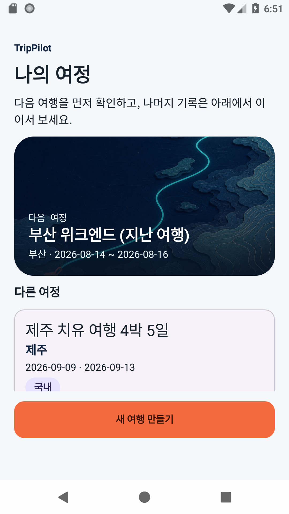
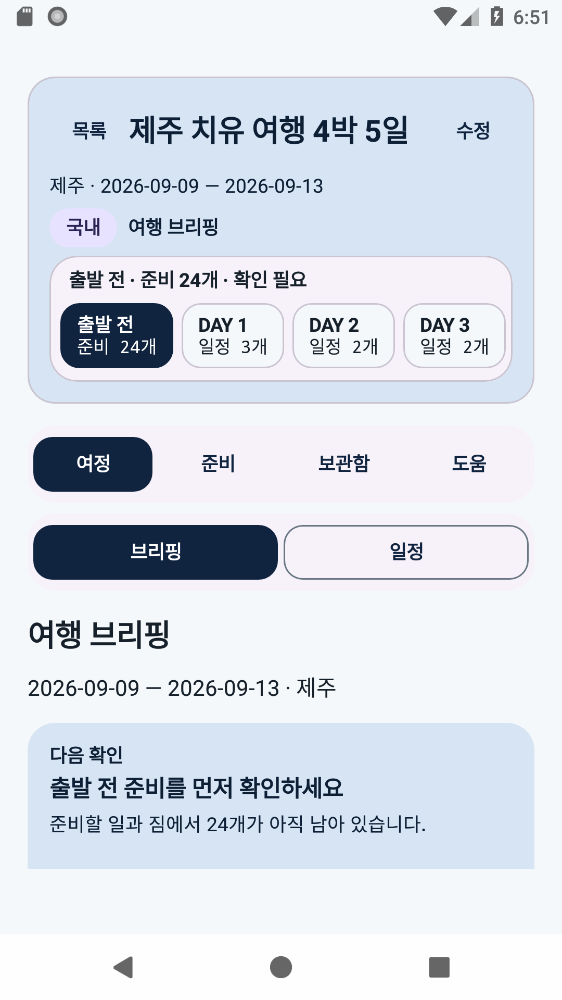
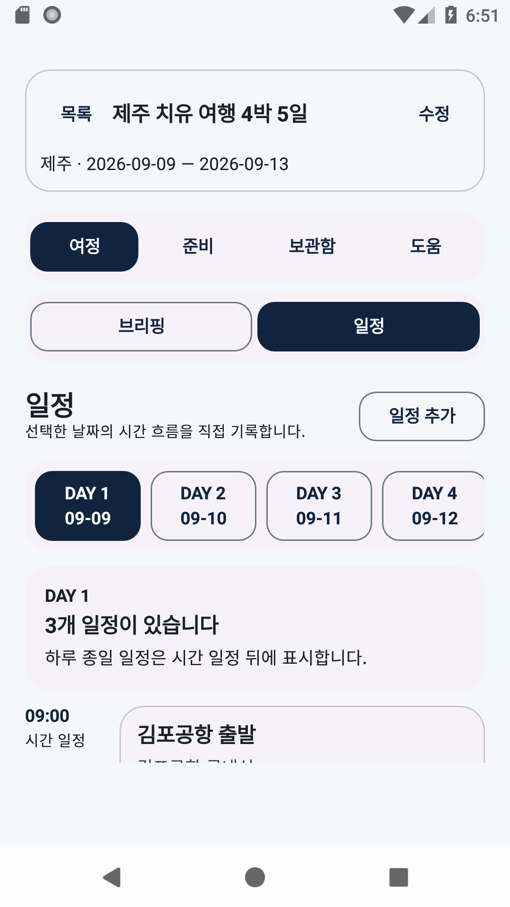
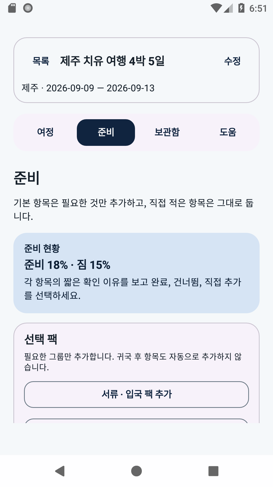
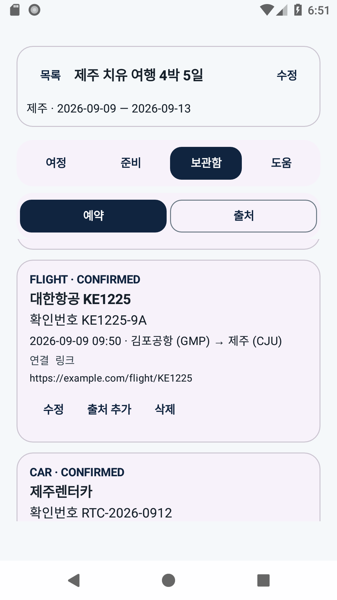
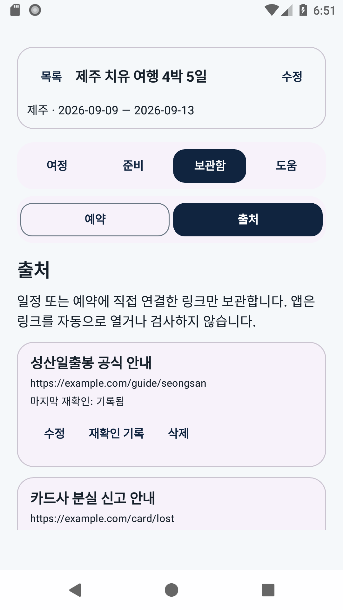
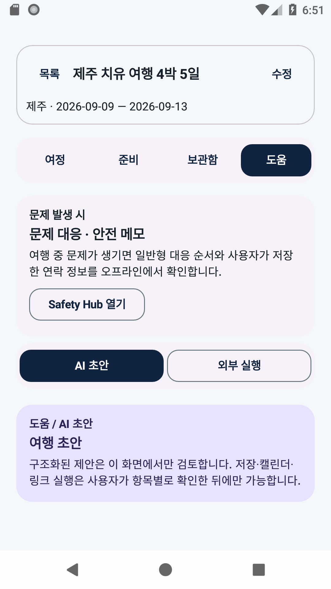
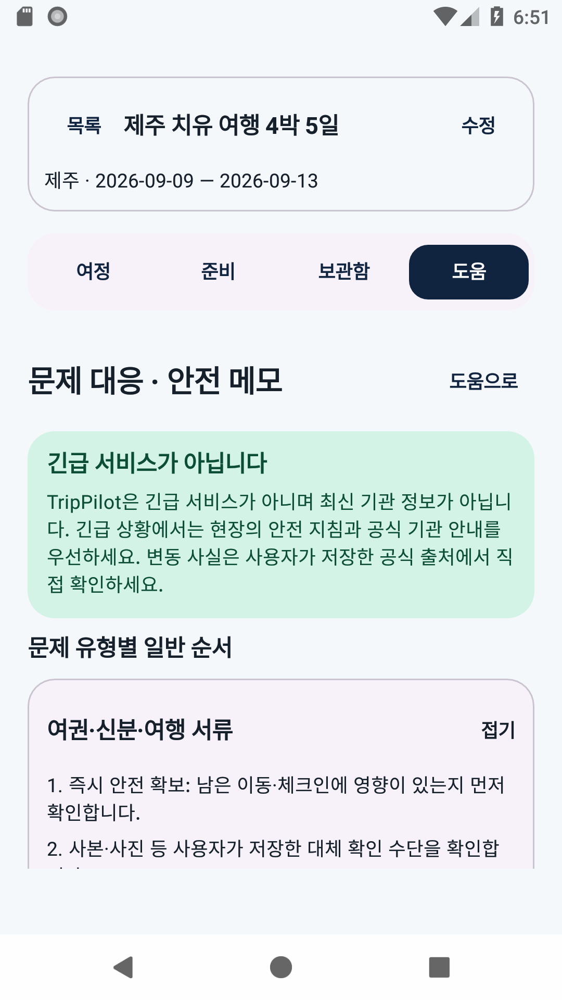

# TripPilot — 로컬 우선 개인 여행 브리핑

출발 전에는 **가장 먼저 확인할 준비 항목**, 여행 중에는 **지금 이어질 일정**, 귀국 후에는 **남아 있는 정리 항목**을 한눈에 판단하게 하는 Android 앱입니다. 모든 여행 데이터는 이 기기의 Room에만 저장되고, AI 초안은 사용자가 항목별로 검토·승인한 것만 반영됩니다.

- **오프라인 우선**: debug 빌드는 INTERNET 권한 자체가 없습니다. 사진 앨범·관광 검색기·자동 실행 Agent가 아닙니다.
- **AI는 초안만**: Codex 런타임이 구조화된 초안을 만들지만, 저장은 사용자가 선택한 항목만 한 번의 로컬 transaction으로.
- **외부 실행은 승인 후**: Calendar·지도·브라우저·파일은 대상과 결과를 말하는 확인 창을 지난 뒤에만 실행됩니다.

## 주요 기능

| 영역 | 기능 |
|---|---|
| 여행 목록 | 다음 여행 featured cover + 다음 행동 1개, 지나간/다가오는 여행 분리 |
| 브리핑 | `JourneyStageStrip`(출발 전 → DAY 1..N → 귀국 후) 실데이터 상태, 귀국 후 시점 CTA |
| 일정 | 날짜 선택 time rail, 시간/종일/종료시각 일정, 항목별 출처 연결 |
| 준비 | 그룹형 체크리스트 + 선택 팩, **귀국 후 48시간/1주/나중 window 팩**(옵트인) |
| 보관함 | 예약 서류(확정/미확정/취소) + 확인번호, 출처 보관·재확인 기록 |
| 문제 대응 (Safety Hub) | 7개 일반형 대응 순서 + 사용자 소유 연락 메모(오프라인) |
| 도움 | AI 초안 검토·반영, ICS/JSON 백업, Calendar·지도·링크 승인 실행 |

기술 스택: Kotlin 2.2 · Jetpack Compose (Material3) · Room v3 · Hilt · DataStore · minSdk 26 / targetSdk 35

## 데모 데이터셋

`ExampleTripData`(계측 테스트 소스)는 앱이 표현할 수 있는 **모든 데이터 형태 19종**을 담은 3개 여행을 제공합니다. 재실행해도 중복 없이 교체됩니다.

```bash
# 에뮬레이터/기기(debug)에 시드 — 저장소 검증 API만 사용
adb shell am instrument -w -e class io.trippilot.app.tools.ExampleTripSeed \
  io.trippilot.app.debug.test/androidx.test.runner.AndroidJUnitRunner
```

| 여행 | 용도 |
|---|---|
| 부산 위크엔드 (지남) | 귀국 후 정리 CTA · 미완료 window |
| 제주 치유 4박 5일 (현재) | 전 영역 완전 데이터 — 종일/종료시각 일정, 예약 3상태, 출처 3종+재확인, AI 반영 항목, 임시 공유 |
| 도쿄 겨울 (미래·국제) | 여권·입국 요건 등 국제 필수팩, 완료된 귀국 후 window, PLANNED 상태 |

### 대표 화면

**여행 목록** — 과거 여행 featured(귀국 후 CTA) + 다른 여정:



**브리핑** — featured cover와 일자별 실데이터 stage strip:



**일정** — 날짜 선택 time rail, 종일 일정 표시:



**준비 — 귀국 후 window** — 48시간/1주/나중 시점별 옵트인 팩:



**보관함 — 예약 서류** — 확정/미확정/취소 상태와 확인번호:



**출처** — 재확인 기록과 함께 보관:



**도움 — Safety Hub 진입** — 두 하위 탭 위 고정 진입 패널:



**Safety Hub — 문제 유형별 일반 순서** — 7개 카테고리, 기관 사실 없는 일반 문구:



**Safety Hub — 내 메모** — 사용자 소유 연락 정보·연결 출처(오프라인):


## 검증

- **정적 계약**: `scripts/verify_design_contract.py` — 디자인 토큰 일치 + slop 게이트 6종 (인라인 색 금지, 단일 주행동, 무한 애니메이션 금지 등)
- **단위/계측**: migration v1→v3, backup v1/v2/v3 왕복, populated UI 회귀, Safety Hub UI — 22+ tests PASS
- **디자인 QA 루프**: `scripts/run_android_design_qa.sh` (에뮬레이터 전용)
- 전체 검증 매트릭스: [`docs/test-matrix.md`](docs/test-matrix.md)

## 문서

- [디자인 방향](design/design-direction.md) · [Hallmark 가이드](design/hallmark-guide.md) · [화면 맵](design/screen-map.md)
- [로컬 데이터 계약](docs/local-data-contract.md) · [개인정보·외부 실행 경계](docs/privacy-and-egress.md)
- [문제 대응·귀국 후 요구사항](docs/readiness-safety-posttrip-gap.md) · [아키텍처](docs/architecture.md)

## 라이선스 고지

`third_party/alpine-codex-cli-client/`에 GPL-3.0 vendored 구성요소가 포함되어 있습니다. 자세한 내용은 [`docs/third-party-notices.md`](docs/third-party-notices.md)를 참고하세요.
