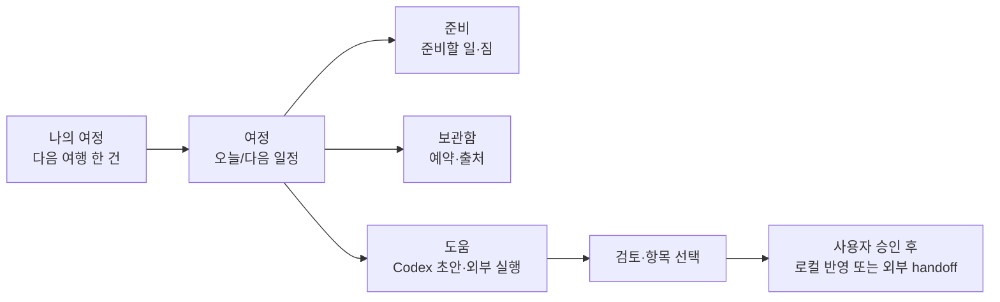

# TripPilot 화면 개선 시나리오 — 2026-08-16

## 선택한 방향

**Field Route Journal**. TripPilot은 예약을 대신하거나 여행지를 보여주는 앱이 아니라, 사용자가 확정한 여행을 ‘다음에 확인할 일’ 순서로 읽게 하는 개인 travel notebook이다.

- **TripIt에서 채택:** 하나의 itinerary를 신뢰 가능한 기준으로 두는 단순함.
- **Wanderlog에서 채택:** 여행별 맥락과 일자 순서가 보이는 정보 구조.
- **의도적으로 배제:** 도시 사진 grid, 지도 상시 노출, 추천 피드, 자동 실행, AI chat UI.
- **Android/Samsung 반영:** 화면 상단은 읽는 영역, 하단은 엄지로 닿는 행동 영역. Compact에서는 최대 4개 목적 기반 navigation, 넓은 화면에서는 list-detail/rail로 전환한다.

## 사용자 흐름



`도움`은 일반 채팅이 아니다. 초안은 검토할 수 있지만, 선택하지 않은 항목은 DB에 저장되지 않으며 외부 action도 자동으로 실행하지 않는다.

## Compact 화면 시나리오

### 1. 나의 여정 (이번에 적용)

```text
┌────────────────────────────────────┐
│ TripPilot                            │
│ 나의 여정                            │
│ 다음 여행을 먼저 확인하고…             │
│ ┌────────────────────────────────┐ │
│ │   [Field Route artwork]         │ │
│ │   다음 여정                      │ │
│ │   도쿄 주말 여행                  │ │
│ │   Tokyo · 09/10 ~ 09/13         │ │
│ └────────────────────────────────┘ │
│ 다른 여정                            │
│ [부산 가족 여행]                     │
│                                      │
│             [새 여행 만들기]          │
└────────────────────────────────────┘
```

- 빈 상태도 같은 artwork을 쓰지만, 텍스트는 `아직 출발 전이에요`와 첫 행동으로 제공한다.
- artwork은 1개의 로컬 bundle이며 사용자 사진·위치·도시 사진을 뜻하지 않는다.
- hero tap은 선택된 여행 상세로만 이동한다.

### 2. 여정 (다음 구현)

```text
┌────────────────────────────────────┐
│ [목록] 도쿄 주말 여행                │
│ 09/10–09/13 · 3박 4일                │
│ ━●━━━━○━━━━○━━━━○  1일째             │
│ 오늘 / 09.10 수                     │
│ 09:00  공항 이동                     │
│ 13:20  숙소 체크인                   │
│ 18:00  저녁 식사                     │
│                         [+ 일정]    │
└────────────────────────────────────┘
```

- Overview와 itinerary를 끊지 않고 시간 순서로 연결한다.
- 날짜 선택은 short day chip/route ribbon에 남기며, section tab을 7개 나열하지 않는다.

### 3. 준비

```text
┌────────────────────────────────────┐
│ 준비                                 │
│ 준비 6/10 · 짐 2/5                  │
│ [준비할 일] [챙길 물건]               │
│ □ 여권 유효기간 확인                  │
│ ✓ 여행자 보험 확인                    │
│ □ 충전기 × 1                         │
│                         [직접 추가]  │
└────────────────────────────────────┘
```

- Preparation/Packing data model은 유지한다.
- 완료율은 숫자와 미완료 항목을 함께 보여준다.

### 4. 보관함

```text
┌────────────────────────────────────┐
│ 보관함                               │
│ 예약 3                               │
│ [항공] 대한항공 · 확인번호 ABC123     │
│ 출처 2                               │
│ [재확인 필요] 호텔 공식 페이지         │
│ 공유한 예약 텍스트                    │
│ 24시간 뒤 삭제 · 분석하지 않음         │
└────────────────────────────────────┘
```

- reservation, source, pending text를 한 곳에서 읽되 각 행동은 분리한다.
- URL/지도/브라우저를 자동으로 열지 않는다.

### 5. 도움

```text
┌────────────────────────────────────┐
│ 도움                                 │
│ AI 초안                              │
│ [계획 요청] → [검토] → [선택 반영]    │
│                                      │
│ 외부 실행                            │
│ Calendar / 지도 / 파일                │
│ 모두 확인 후 실행됩니다                │
└────────────────────────────────────┘
```

- Codex, 외부 action, file export를 하나의 “자동화”로 보이지 않게 구분한다.
- Calendar/지도/브라우저/파일은 현 ConfirmActionSheet를 유지한다.

## 구현 순서

| 순서 | 화면/구성요소 | 변경 | 보존할 계약 |
|---:|---|---|---|
| 1 | 여행 목록 | JourneyHero, featured journey, empty state | local-only CRUD, `새 여행 만들기` |
| 2 | 상세 shell | 7 section → 4 user-purpose 영역 | 모든 도메인 데이터와 testTag/semantics mapping |
| 3 | 여정/준비/보관함 | timeline, segmented readiness, grouped storage | 일정·예약·출처 CRUD |
| 4 | 도움/입력 | review surface, modal sheet, copy | AI 비자동 반영, 외부 승인 |
| 5 | adaptive/QA | compact nav, medium rail/list-detail, screenshot | light/dark, 2.0x, TalkBack, offline |

## 이미지 정책

- 포함 artwork: `trippilot_field_route_hero_v1.png` 한 종.
- 출처/해시/표시 위치: [`docs/asset-manifest.md`](../docs/asset-manifest.md) 정본.
- 불허: 도시 사진, 사용자 사진, 지도, 국기, 외부 icon pack, 런타임 이미지 download, text/logo/watermark가 있는 이미지.
- artwork은 decorative이며, 제목·기간·상태 정보의 유일한 전달 수단이 될 수 없다.
