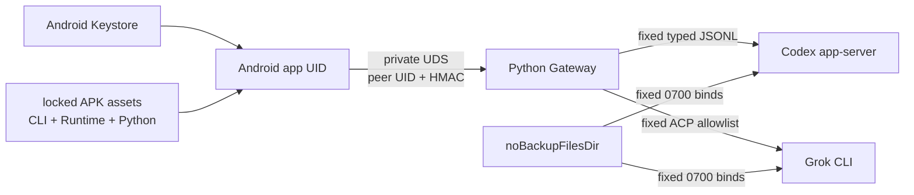

# Alpine Agent CLI Client 보안 검토 및 조치 현황

- 최초 전문가 검토: `2026-08-15 KST`, 기준 `ec94f99`
- 조치 재평가: `2026-08-15 KST`, 구현 기준 `e15b808`
- 범위: Android 앱, Alpine/PRoot, Python Gateway, Codex/Grok CLI, OAuth 경계, 저장·백업,
  Runtime/Gradle/release 공급망
- 방법: 소스 정적 감사, 자동 단위·통합·적대적 테스트, APK clean-room 감사, redacted Samsung evidence
- 제외: 루팅 단말, 네이티브 binary 전체 퍼징, OpenAI/xAI/브라우저 내부 보안, 실제 release key 운영,
  스토어 심사

## 1. 현재 결론

최초 검토에서 확인된 가장 직접적인 prompt 탈취 경로인 고정 TCP loopback transport는 제거됐다.
현재 Android↔Gateway 제품 경로는 app-private filesystem Unix domain socket, 양방향 peer UID 확인,
세션별 HMAC/timestamp/nonce 검증으로 고정된다. backup/D2D 전면 제외, 민감 상태 migration,
pre-auth resource bound, dependency lock, Runtime package SPDX/lock, 2-slot rollback, external release
signing과 최종 artifact gate도 구현됐다.

따라서 **소스와 배포 파이프라인은 조건부 공개 배포 준비 상태**다. 다만 현재 저장소만으로 실제
공개 artifact를 만들 수는 없다. 검토된 production Alpine Python package pack과 외부 release
signing 입력이 없으면 packaging이 fail-closed하며, 두 입력을 적용한 최종 Samsung release 후보
E2E도 남아 있다.

동일 Android UID 안에서 실행되는 Codex/Grok/Gateway/PRoot는 서로에 대한 커널 수준 sandbox가
아니다. 또한 현재 Alpine rootfs의 package 위험과 Gradle checksum coverage 일부는 제거가 아니라
명시적 잔여 위험 수용으로 처리됐다. 이 두 항목을 “해결됨”으로 표현해서는 안 된다.

## 2. 발견 사항별 상태

| ID | 최초 심각도 | 발견 사항 | 현재 상태 | 배포 판단 |
|---|---:|---|---|---|
| SEC-001 | High | 고정 평문 TCP loopback 선점·서버 위장 | **완화 완료** — private UDS, 양방향 peer UID, HMAC | 차단 해제 |
| SEC-002 | High | 같은 UID/PRoot 안의 논리적 Agent 분리 | **잔여 위험 수용** — fixed HOME/bind/typed contract, 별도 UID 아님 | 문서화 조건 |
| SEC-003 | High | 고정 Alpine 3.21.3 package 취약점 가능성 | **잔여 위험 수용** — exact lock, 15-package SPDX, scoped snapshot | 정책상 차단 제외 |
| SEC-004 | Medium | backup/D2D 제외와 민감 경로 불완전 | **완화 완료** — 전면 exclusion, no-backup migration | 차단 해제 |
| SEC-005 | Medium | 인증 전 threaded HTTP resource 고갈 | **완화 완료** — backlog/concurrency/deadline/size bound | 차단 해제 |
| SEC-006 | Medium | Kotlin/Gradle cache 역직렬화 노출 | **부분 완화** — Gradle/Kotlin cache·incremental off | version 추적 필요 |
| SEC-007 | Medium | dependency/wrapper 무결성 coverage 부족 | **부분 완화** — 모든 module lock·repo 제한, checksum 일부 미완료 | 문서화 조건 |
| SEC-008 | Low | nonce 저장소 포화와 긴 정상 요청 거절 | **완화 완료** — 5초 bounded bucket와 보수적 burst | 차단 해제 |

## 3. 현재 보안 구조



### 보호 자산

- CLI-owned Codex/Grok OAuth credential
- Device OAuth challenge URL/code
- Gateway session capability와 HMAC key material
- prompt, response, model, conversation/session binding
- app-private CLI, profile, Gateway source, Runtime filesystem
- release signing identity와 production package input

### 외부 통신 원칙

허용되는 외부 통신은 공식 Codex/Grok CLI가 소유하는 OAuth와 사용자가 시작한 Agent traffic뿐이다.
Android/Gateway는 Provider inference endpoint, backup, Smart Switch, sync, analytics, telemetry,
cloud storage 또는 런타임 package repository를 직접 호출하지 않는다.

## 4. 핵심 조치 상세

### SEC-001 — private UDS 전환

**상태: 완화 완료**

- `UnixDomainSocketGatewayTransport`가 filesystem `LocalSocket`만 사용한다.
- Android는 연결 직후 kernel peer credential UID를 앱 UID와 비교한다.
- `PrivateUnixGatewayServer`도 client peer UID를 확인한다.
- socket은 app-private Runtime workspace의 고정 경로만 허용한다.
- request signer는 body hash, timestamp, nonce, HMAC을 모든 route에 적용한다.
- redirect, proxy, alternate endpoint와 TCP fallback은 없다.
- 테스트용 loopback fixture는 compile-time transport seam 뒤에 있으며 APK에 제품 구현으로 포함되지 않는다.

남은 한계는 같은 UID의 손상된 process다. 이는 SEC-002 범위다.

### SEC-002 — 동일 UID의 논리적 분리

**상태: 잔여 위험 수용**

적용된 방어는 Codex/Grok별 HOME, 고정 bind destination, canonical path·symlink·owner·mode 검증,
고정 executable/arguments/environment, Agent-tagged state와 typed protocol이다. 정상 동작의 오염과
Android 입력에 의한 임의 method/path 선택은 차단한다.

그러나 PRoot와 별도 process는 별도 Android UID가 아니므로 손상된 native CLI/Gateway가 같은 앱
UID의 다른 private 파일에 접근하는 것을 커널이 막지 않는다. 별도 UID broker는 현재 공개 배포
필수 범위에서 제외됐다. 공식 CLI/Gateway binary와 lock을 신뢰한다는 전제가 필요하다.

<a id="SEC-003"></a>

### SEC-003 — Runtime package 위험

**상태: 잔여 위험 수용**

현재 Alpine `3.21.3` rootfs, PRoot, loader와 15개 installed APK package는 hash와
`runtime-lock.json`에 고정된다. SPDX 2.3 문서는 deterministic regeneration으로 검증되고, local
vulnerability snapshot은 정확한 Runtime hash에 scope된다. Python은 고정 `.apk` pack만
`apk --no-network --no-cache`로 설치하며 repository/package-name fallback이 없다.

snapshot은 의도적으로 완전한 온라인 취약점 DB라고 주장하지 않는다. patched rootfs 전체 교체는
사용자 결정에 따라 release 필수 조건이 아니며, 현재 package 위험은 inventory와 잔여 위험으로
공개한다.

### SEC-004 — backup/D2D와 민감 상태 migration

**상태: 완화 완료**

- manifest `allowBackup=false`
- Android 12+ cloud backup과 device transfer 전체 domain exclude
- legacy full backup 전체 domain exclude
- Codex/Grok/Gateway capability/대화 state를 versioned `noBackupFilesDir` direct child로 migration
- symlink 미추적, UID/GID/type/mode/size/hash/space bound, atomic rename/fsync/commit marker
- 기존 상태를 먼저 삭제하지 않는 rollback 보존
- Samsung data-preserving `install -r`에서 OAuth/history/composer 복구 확인

### SEC-005/008 — pre-auth 자원과 replay bound

**상태: 완화 완료**

Gateway는 최대 8개 concurrent connection/backlog, 인증 완료까지 5초 absolute deadline, 4 KiB
request line, 16 KiB aggregate header, 32 KiB body를 적용한다. nonce는 5초 bucket과 네 요청/초,
2배 burst를 기준으로 bounded하며 live replay entry를 제거해 정상 요청을 받는 우회가 없다.
긴 authenticated SSE turn에는 서비스 수준 timeout을 별도로 적용한다.

### SEC-006/007 — Gradle 공급망

**상태: 부분 완화**

- 14개 module과 settings dependency lockfile 추적
- dynamic/range/latest/SNAPSHOT selector 거부
- repository를 Google, Maven Central, Gradle Plugin Portal로 제한
- Gradle/Kotlin build cache와 Kotlin incremental compilation 비활성화
- 일반 build에서 lock 자동 갱신 금지
- CLI/Runtime/Python/Gateway/component inventory와 signed artifact를 별도 verifier로 재검사

현재 local cache에 Gradle distribution ZIP과 필요한 plugin transitive 원본이 없어서
`distributionSha256Sum`과 `verification-metadata.xml`은 생성되지 않았다. 이 두 값을 적용하기 전까지
lock coverage와 최종 artifact gate가 완전한 download provenance를 대체한다고 주장하지 않는다.

## 5. OAuth와 대화 보호

- Android와 Gateway는 CLI credential 파일이나 `auth.json`을 읽고 복사하지 않는다.
- OAuth challenge는 complete HTTPS URL만 한 번 Android memory로 전달한다.
- Grok은 exact `auth.x.ai`, `accounts.x.ai` host만 허용하고 suffix lookalike를 거부한다.
- global `FLAG_SECURE`로 민감 화면 capture를 차단한다.
- 대화는 Android Keystore AES-GCM과 application-bound AAD로 저장한다.
- 로그에는 account/model/request/conversation/URL/prompt/response가 아닌 fixed state와 counter만 남긴다.
- 앱/Gateway는 prompt 자동 retry, replay, cross-Agent fallback을 하지 않는다.
- Grok chat-only profile은 `task`, `search_tool`, `use_tool` 및 금지 profile event를 fail-closed한다.

## 6. Runtime과 배포 공급망

### Runtime

- rootfs/PRoot/loader/package SPDX hash 고정
- staging 검증 후 active/previous 두 generation만 보존
- interrupted install/rollback을 pending marker로 복구
- rollback이 workspace와 no-backup credential/session을 이동하거나 지우지 않음
- Python package lock/SBOM/`.PKGINFO`/signed APK member/hash 검증 후 atomic staging
- `apk --simulate --no-network` 성공 후 실제 local 설치와 Python/Gateway import smoke

### Release

- `release`: `dev.alpine.codexclient`, version `2`/`0.2.0`, non-debuggable
- 네 개의 `ALPINE_RELEASE_*` 값이 일부만 있거나 keystore가 없으면 configuration/package 실패
- production Python pack이 없으면 모든 release package/sign route 실패
- 저장소에 private key, keystore, APK/AAB, production package bytes를 추적하지 않음
- 최종 verifier가 package/version/manifest/certificate/CLI/profile/Gateway/Runtime/Python/SBOM/
  component inventory와 금지 provider/API-key byte를 확인

## 7. 자동 검증 기준선

구현 기준선 `e15b808`에서 다음 credential-free gate가 통과했다.

```bash
sh scripts/verify-secure-debug-milestone.sh
```

| 검증 | 결과 |
|---|---|
| Python unit/integration/adversarial | PASS — 160 tests |
| Gradle unit/lint/build verification | PASS — 884 tasks |
| Codex app-server fixture | PASS |
| debug/secureDebug clean-room | PASS |
| Grok CLI/profile/ACP | PASS |
| private UDS/HMAC와 backup policy/migration | PASS |
| Runtime/Gradle/Python/release policy | PASS |
| secure APK, sensitive evidence, reference gate | PASS |
| tracked private-key/credential scan | PASS |

production Python package가 없을 때 release packaging verifier가 실패하는 것은 의도한 release
정책이다. 전체 gate는 unavailable state와 fail-closed 연결을 검증한다.

## 8. 실기기 evidence

Samsung `SM-S931N`에서 다음이 redacted 방식으로 확인됐다.

- 공식 Grok OAuth와 live model readiness
- 실제 streaming turn과 실제 Stop의 terminal-once/cancel audit
- 두 번의 force-stop과 background/foreground 후 OAuth/history/composer 복구
- Codex readiness 확인 후 Grok 복귀, process 단일성
- private UDS, peer UID, HMAC, TCP-negative, socket cleanup
- data-preserving migration과 no-backup bind

당시 APK hash와 테스트 수는 각 evidence 문서에 보존한다. 이후 source에 APK 내장 Python pack
경로가 추가됐으므로 production pack을 포함한 최종 release artifact의 실기기 E2E는 별도로 필요하다.

## 9. 배포 판정

| 대상 | 현재 판정 | 조건 |
|---|---|---|
| credential-free 개발/CI | **GO** | 기준 source/cache/reference 입력 유지 |
| 통제된 `secureDebug` 실제 OAuth | **GO** | runbook 승인, data-preserving install, 민감 evidence 금지 |
| public release source path | **CONDITIONAL GO** | 잔여 위험 공개와 fail-closed gate 유지 |
| 실제 signed APK/AAB 생성 | **BLOCKED BY INPUT** | production Python pack + 외부 signing 4종 필요 |
| 스토어 제출 | **NOT READY** | signed artifact audit + offline-pack Samsung E2E + 사용자 승인 |

`BLOCKED BY INPUT`은 구현 실패가 아니라 저장소에 배포 비밀과 production package를 넣지 않는
정책 결과다.

## 10. 남은 조치

### 공개 artifact 생성 전 필수

1. 검토된 Alpine `aarch64` production Python/전이 package pack 제공
2. 외부 keystore와 예상 signing certificate SHA-256 제공
3. `assembleRelease`/`bundleRelease`와 `verify-release-artifact.py` 통과
4. 실제 Samsung release 후보에서 Runtime/OAuth/model/turn/Stop/force-stop 회귀
5. 배포 승인과 store 제출 절차 확정

### 방어 심화 선택 항목

1. 별도 Android UID broker/isolated runtime으로 Agent 간 커널 경계 강화
2. patched Alpine rootfs와 완전한 최신 취약점 database 운영
3. Gradle dependency verification metadata와 wrapper distribution SHA-256 추가
4. native CLI/PRoot/Gateway fuzzing과 루팅·악성 동일-UID 시나리오 검토
5. release key rotation, CI secret access, provenance와 incident response 운영 문서화

## 11. 관련 문서

- [프로젝트 개요](docs/project-overview.md)
- [Architecture](docs/architecture.md)
- [Security model](docs/security-model.md)
- [보안 회귀 matrix](docs/security-regression-matrix.md)
- [Backup/D2D migration](docs/backup-migration.md)
- [Runtime 공급망](docs/runtime-supply-chain.md)
- [Gradle 공급망](docs/gradle-supply-chain.md)
- [공개 배포 가이드](docs/public-release.md)
- [Samsung evidence 인덱스](docs/README.md#samsung-실기기-검증)

이 보고서의 현재 판단은 “외부 서비스를 추가하지 않고, APK 내부 실행 경로와 fail-closed 배포
경계를 강화한다”는 프로젝트 원칙을 기준으로 한다.
